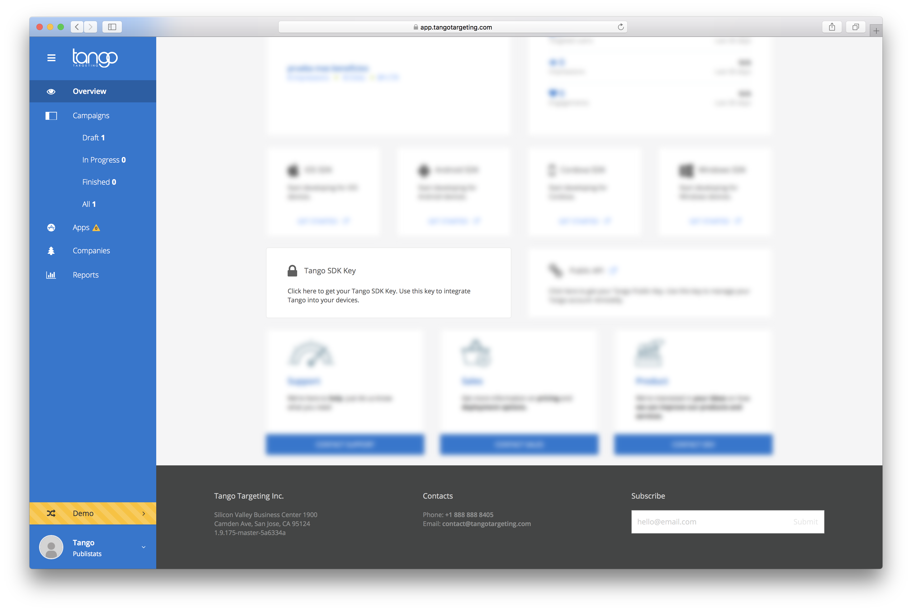
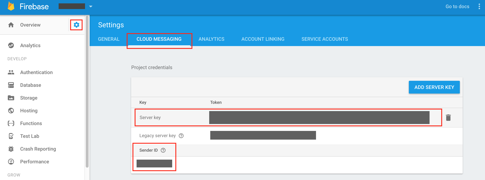

!!! important
    Tango Targeting SDK requires at least Android 4.0.1.

### Add the maven repository

In your app's root ```build.gradle``` file add the Tango Targeting maven repository.

```groovy
buildscript {
    repositories {
        ...
        maven { url 'https://maven.tangotargeting.com/repository/maven-public' }
        ...
    }
}

allprojects {
    repositories {
        ...
        maven { url 'https://maven.tangotargeting.com/repository/maven-public' }
        ...
    }
}
```

### Add the Gradle dependency

In your app's root ``build.gradle`` file add the following dependency.

```groovy
compile ('com.tangotargeting:tango:2.0.0') {
	transitive = true;
}
```

### Add your Tango API key 

In `AndroidManifest.xml`, add the `meta-data` containing your Tango API key:
```xml
<application>
    ...
 	<meta-data
        android:name="tango_api_key"
        android:value="your-tango-sdk-key"/>
    ...
</application>
```

!!! Important
    To find your Tango API KEY [Go to Console :fa-external-link:](https://app.tangotargeting.com/) and locate the card **Tango SDK Key**
    
    then hover it and click the copy icon on the right.
    

### Setup Firebase in your project

Tango uses FCM to send real-time campaigns to devices. 

If you prefer not to use the Firebase Assistant, you can still add Firebase to your app using the Firebase console.

To add Firebase to your app you'll need a Firebase project and a Firebase configuration file for your app.

1. Create a Firebase project in the [Firebase console](https://console.firebase.google.com/), if you don't already have one. If you already have an existing Google project associated with your mobile app, click **Import Google Project**. Otherwise, click **Create New Project**.
2. Click **Add Firebase to your Android app** and follow the setup steps. If you're importing an existing Google project, this may happen automatically and you can just [download the config file](https://support.google.com/firebase/answer/7015592).
3. When prompted, enter your app's package name. It's important to enter the package name your app is using; this can only be set when you add an app to your Firebase project.
4. At the end, you'll download a `google-services.json` file. You can download this file again at any time.
5. If you haven't done so already, copy this into your project's module folder, typically `app/`.
6. First, add rules to your root-level `build.gradle` file, to include the google-services plugin: 
```groovy
buildscript {
    // ...
    dependencies {
        // ...
        classpath 'com.google.gms:google-services:3.1.0'
    }
}
```
7. Then, in your module Gradle file (usually the app/build.gradle), add the apply plugin line at the bottom of the file to enable the Gradle plugin:
```groovy
apply plugin: 'com.android.application'

android {
  // ...
}

dependencies {
  // ...
  compile 'com.google.firebase:firebase-core:11.0.4'
  
  // Getting a "Could not find" error? Make sure you have
  // the latest Google Repository in the Android SDK manager
}

// ADD THIS AT THE BOTTOM
apply plugin: 'com.google.gms.google-services'
```

!!! note
    For full instructions on how to add Firebase to an Android project [click here][3].

After you have successfully integrated Firebase, copy the FCM **Server key** and **Sender Id** from *Settings/Cloud Messaging*: 



Then go to Tango Console and add them to your app.


Hit the **Update** button.

### Add permissions

Tango SDK relies on the following permissions:

```xml
<!-- Runtime permissions-->
<uses-permission android:name="android.permission.READ_EXTERNAL_STORAGE"/>
<uses-permission android:name="android.permission.ACCESS_FINE_LOCATION"/>

<!--Normal permissions-->
<uses-permission android:name="com.android.browser.permission.READ_HISTORY_BOOKMARKS"/>
<uses-permission android:name="android.permission.INTERNET"/>
<uses-permission android:name="android.permission.RECEIVE_BOOT_COMPLETED"/>
```

You do not need to add these permissions to your Android Manifest file. However, if your ` targetSdkVersion` is higher than **22** you will need to request the `android.permission.ACCESS_FINE_LOCATION` and `android.permission.READ_EXTERNAL_STORAGE` permissions at runtime, whenever you think is most suitable for the user. [Here][4] is how to request a persmission at runtime.

!!! important
    There are open-source libraries that can help you manage runtime permissions. Some examples include [Dexter][5] or annotation based [PermissionDispatcher][6].

## You are ready to go!

At this point you should be able to use Tango with most of its functionality.

## Test

To test if the installation succeeded you should enter the Tango Targeting account then create and activate some campaigns. The easiest way is to create a real-time campaign but it pays off to test all campaigns as some of them have specific needs(like location permissions). 

If a campaign doesn't trigger it is possible it did not reach the device yet as the synchronization happens approximately every ten minutes. To go around this, you could simply restart the application and a synchronization will immediately trigger. Note that real-time campaigns don't need any synchronization to work. 

 [1]: http://tangotargeting.com
 [2]: https://app.tangotargeting.com/integration/android
 [3]: https://firebase.google.com/docs/android/setup
 [4]: https://developer.android.com/training/permissions/requesting.html#perm-check
 [5]: https://github.com/Karumi/Dexter
 [6]: https://github.com/hotchemi/PermissionsDispatcher