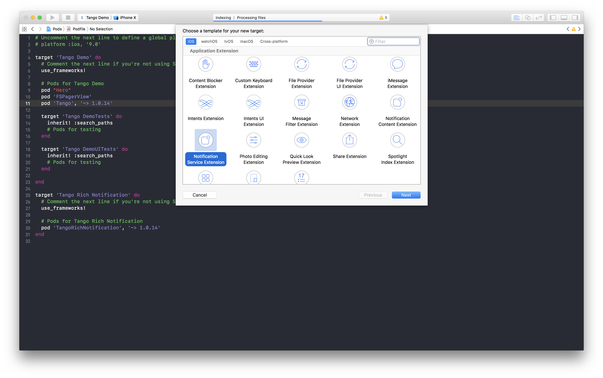
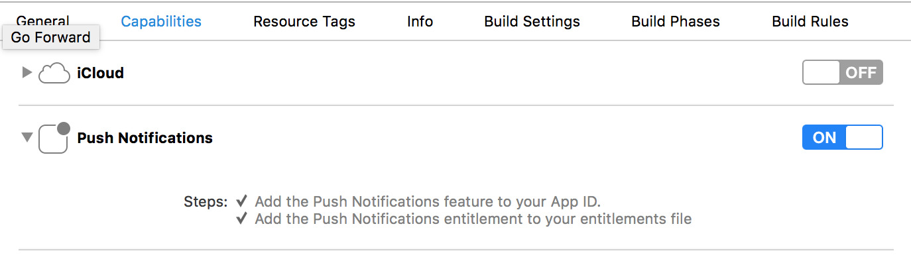
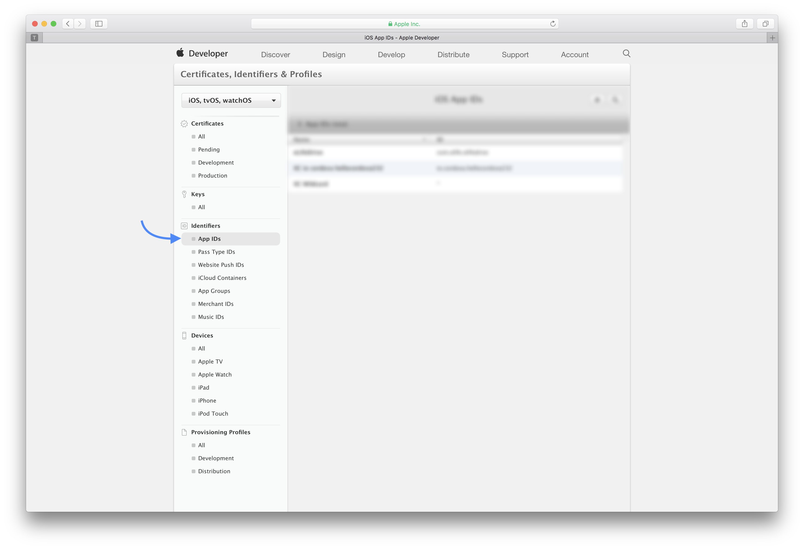
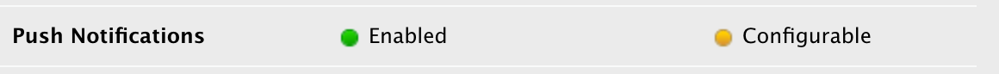
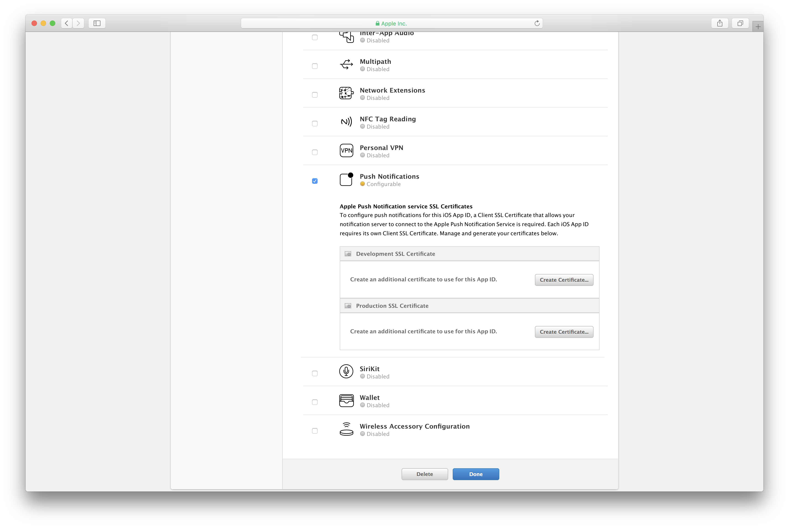
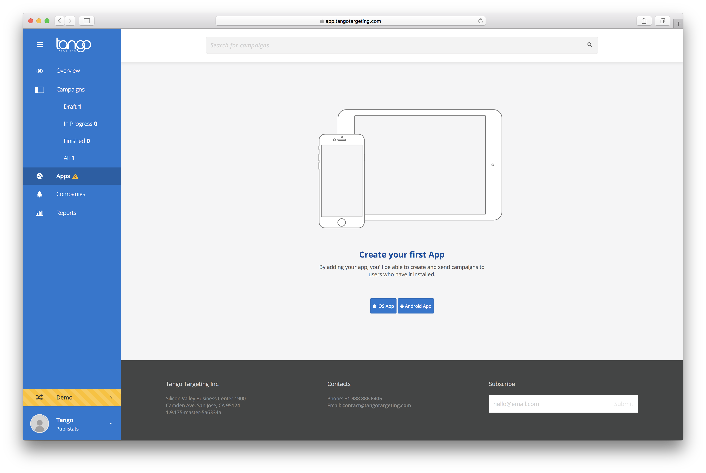

### Requirements

- iOS 9.0+ for Tango framework only
- iOS 10.0+ if you use both Tango and TangoRichNotification framework
- Xcode 8.1+
- Swift 3.2+

### Install with CocoaPods

CocoaPods is a dependency manager, which automates and simplifies the process of using 3rd-party libraries in your projects. See the [Getting Started](https://guides.cocoapods.org/using/getting-started.html) guide for more information. You can install it with the following terminal command:

```
$ gem install cocoapods
```

After installing go to your project directory and type this commad:

```
$ pod init
```

In project folder it will appear a file called Podfile. Open it and integrate Tango by typing:

```
target 'TargetName' do
  use_frameworks!
  pod 'Tango', '~> 1.0.14'
end
```

After filling the Podfile save it and run the following command in the Terminal:

```
$ pod install
```

Close your project, go to your project location on disk and open the workspace the newly created `.xcworkspace` file inside your project directory. Now the framework can be used and for that please follow "How to use" guide.


### iOS 10 Rich Notifications

The library has support for iOS 10 notifications attachments. You can add images and GIF files in a notification. For using this functionality you will need to create a  [notification service extension](https://developer.apple.com/reference/usernotifications/unnotificationserviceextension/).

Create a new iOS target in Xcode (File -> New -> Target) and select the Notification Service Extension type



Add a new target for notification extension in your podfile. Add TangoRichNotification framework, by adding the following lines to your podspec:

```
target 'NotificationServiceExtesion-Target-Name' do
  use_frameworks!
  pod 'TangoRichNotification', '~> 1.0.14'
end
```
After filling Podfile save it and run the following command in a Terminal window:

```
$ pod install
```

### Add capabilities

For using push notifications you should enable some more capabilities. Go to Xcode select the target’s Capabilities pane and enable push notifications:



You should also enable Background Modes an Remote notifications capabilities:


### APNS Setup
After you setup the framework in order to use push notification you should create an APNS Certificate which requires membership in the [iOS Developer Program](https://developer.apple.com/programs/).

Go to [Apple Developer Members Center](https://developer.apple.com/account/ios/certificate/), click on App IDs from Identifiers section, then follow the steps provided below.



1. Select your app id. If you don't have an app id created select +  button and fill out the form, be sure you check Push Notification checkbox.
2. Expand your app by selecting your app id and you will see a field named Push Notifications with yellow or green status icons for development or distribution: 
3. Click edit button, go to Push Notifications section and press the button **Create Certificate...** for distribution or development. Follow the instructions to create a Certificate Signing Request (CSR) file from your Mac. When you're done, press **Continue**.
4. Upload the CSR and after that press download to get the Certificate.
5. Open the certificate. Opening the certificate will open Keychain Access.
6. Select your certificate from  Keychain Access in My Certificates section. If the certificate is not here try in Certificate section. Right click on it and then Export "Apple iOS Development/Distribution Push Service: your_app_bundle".
This command will export the certificate in a .p12 file with a password.

### Add Certificate to Tango
After generating the Push Notification certificate go [here](https://app.tangotargeting.com/app) and create a new iOS app:



After that you should fill the form with your app data:
- insert app bundle id
- insert app name
- drag and drop  .p12 file from previous step


Please continue reading the [Prepare and initialize](/developer-guide/ios/prepare-and-initialize/) chapter, in order to finish integrating Tango SDK into your app.

[1]: http://tangotargeting.com
