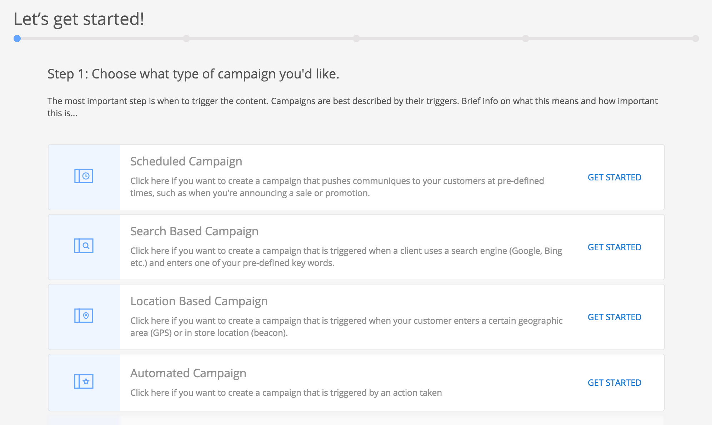
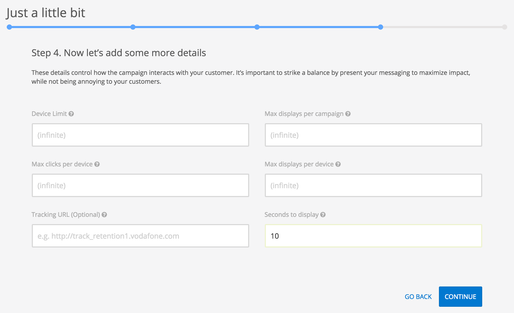

In this section we will walk you through the process of creating a campaign. 

Suppose Penguin Airlines has 50% discounts for all destinations on its 5th Anniversary Celebration. The goal of the campaign is to send a real time message (push notification) to all users to inform them about this special offer and allow them to quickly book flights.

To create a campaign the **Campaigns** tab in the left side menu must be selected. Once we are there we will press the blue button in the top right corner labeled *New Campaign*.

### Enter your account

If you don't have an account yet, create one by starting a demo at [this URL](https://app.tangotargeting.com/demo-request). Then, to be able to test the campaigns, please install the [Android]() or [iOS]() app on your phone and scan the QR code from your Tango account.

### Type

The first step in creating a campaign is to determine its type. In the image below is represented what we see in the Tango Console. 

Following this section are details for each campaign type. For this scenario we will create a **Scheduled Campaign** which is at the top of the list.

### Details

The next thing we'll see is a screen were we will add some details about our campaign.

Apart from specifying the campaign name, this step is the only one that differs for each campaign type. Every campaign must have a name for easy identification. Thus, the name must be unique. We will call ours **5th Anniversary Celebration Discount**. 

We chose to create a scheduled campaign, but now we are given three options. We said we want to send the our offer in real time, meaning we want a push notification, so we will choose to **Send immediately**. For more on real-time campaigns check [[Real-time]] campaigns page. The other two options are discussed in [[Specific dates]]  campaigns and [[Recurrent]] campaigns.

### Content (The Message)

Scrolling down and clicking the **Continue** button will take us to the screen where we will build the content presented to the user when the notification is received.

Let's add a title the title "Celebrate Penguin Airlines" and a body that describes the offer. Also, we must add the primary action. In our case it will take the user to the home page of Penguin Airlines website where the user can start booking flights and find additional information about the offer. We could add a secondary action that could open another web page with other ways to benefit of the offer, like becoming a member.

It is also a good idea to add an image with the company logo (maybe with some fireworks in this case) for a stronger impact on the user. 

Now that we have our content built, lets move to the next step.

### Specifics

Here we have some rules for displaying the message, such as how many devices should receive the message or the maximum displays for each device, etc. Most probably, we will rarely use these rules but it is good to know them if we have some limitations for our campaign. For instance, if we had only 1000 discounts available, we could set the *Device limit* to 1000.

We are happy with the default values as we want our campaign to reach as many customers as possible, so we will simply move on to the next step.

### Audience

We are almost done. Before sending the campaign we have to decide who should receive it. First of all, we may have several applications added to our account. We will choose the ones that are of interest to us. 

After selecting the the apps, we can filter further by adding tags. Tags are some strings defining a certain group of users (e.g.: "student", "shopper", etc.). We will ignore tags for now, but more information about them is in section [[What is a segment?]].

Further below are other filters that may e handy to us. For instance, we may want to send the campaign to LG devices only, for that we can check the name of the device in the *Name* dropdown field. 

Note that only the filters that have actual data on the server will be displayed, for example if no iPhone device have yet used our app then no iPhone data will reach Tango servers and **iPhone** will not appear in the *Name* filter.

Getting back to our scenario, lets suppose we don't want to filter anything, so wi will continue with finishing the creating our campaign. We'll hit **Continue** and see a screen with the overview of our campaign. If we missed something or want to make changes to the campaign we can do that by pressing the **Edit** button. Otherwise we will continue with submitting the campaign.

### Send/Activate

Once we have finished and submitted our campaign we will see it at the top of the campaigns list under *Drafts*.

For real-time campaigns we have the "SEND NOW" option. All the other campaigns have "ACTIVATE". The difference is that real-time campaigns are pushed immediately to all devices, whilst the others reach the devices when the devices are ready to synchronize with the server data. The latter ensures that all matching devices will receive the campaign.

Pressing "SEND NOW" will open a confirmation dialog which also informs us about the number of targeted devices and the option to "PROCEED" or "POSTPONE". When we are sure we want to send it we will hit "PROCEED". The next thing we would most likely want to do is to see the impact our campaign had: how many devices where reached, how many users saw the message and how many started booking a flight, etc. This information is available when clicking the the campaign in the *In Progress* campaign list.

More information about campaign insights is covered in the [[Insights]] section.

We are done.
