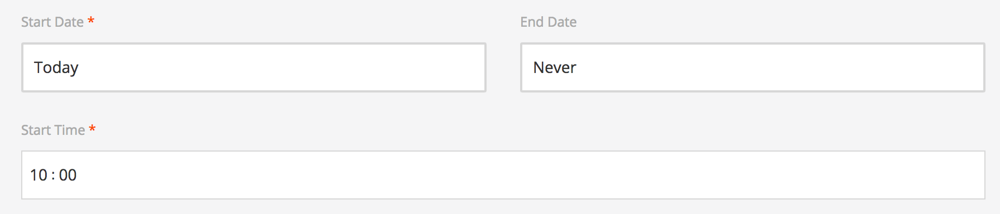
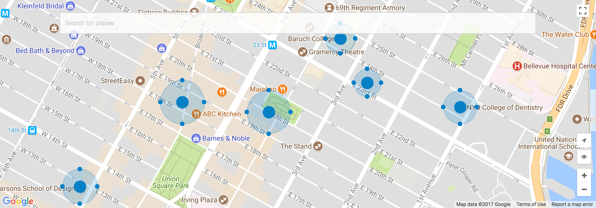
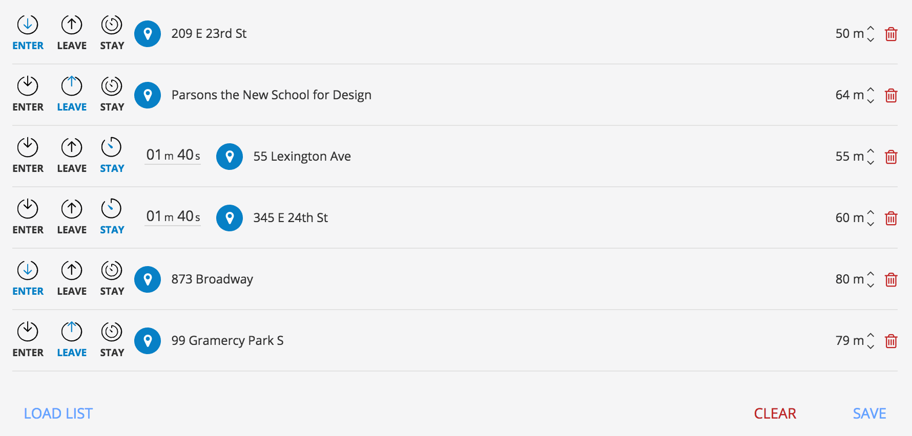

Location campaigns are campaigns triggered when the device is in a specific place on the globe. There are three types of events that trigger a location campaign: entering the location, spending a certain amount of time in the location and exiting the location. 

Suppose a cinema wants to inform cinema goers about some movies. When entering the range of the cinema location, a campaign could inform the customer about the movies starting in the next half an hour. Or, after spending some time around the cinema it could show a message with the most appreciated movies currently running. Or, when leaving the location, it could announce the premiere of a movie. Each of these campaigns would have a button for booking movies.

To create a location campaign go to your Tango account and select the Campaigns tab in the left side menu. Press on "New Campaign" and select a platform you want to create the campaign for. Then simply choose **Location campaign**.

In step 2, specify the start and end date.

Further below is a Google map on which the points of interest(locations) should be specified. A location is a blue filled circle with an additional surrounding circle defining the range of the active zone. Additionally, you can use the search bar if you can't find a place on the map.

Below the map is the list of all selected locations. On the right side for each item you can choose one of the three events that will trigger the campaign: **ENTER**, **LEAVE**, **STAY**. When choosing *STAY* you will also have to specify the amount of time needed to pass after the ENTER event was triggered. We recommend choosing at least 1 minute, otherwise it doesn't differ too much from an ENTER trigger.

On the far left, each item has a spinner which specifies the range of the location. The location precision may vary from a device to another. Hence, it is a good idea to have some extra meters for better coverage.

The location list can be saved for later uses. Give it a descriptive name and load it the next time you intend to use it in a location campaign.