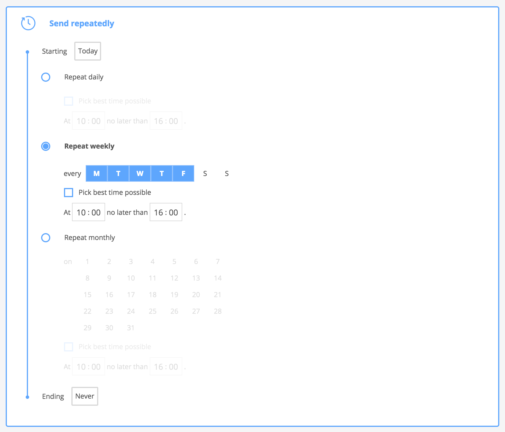

Scheduled campaigns are campaigns that you want to act immediately or sometime in the future, be it today or several month from now, depending on the context. To cover all use cases we have three types of scheduled campaigns.

* [Real-time](#real-time)
* [Specific dates](#specific)
* [Recurrent](#recurrent)

To start creating  a scheduled campaign go to your Tango  account and select the *Campaigns* tab in the left side menu. Press on "New Campaign" and select a platform you want to create the campaign for. Then simply choose **Scheduled campaign**.

## Real time

The concept behind real-time campaigns is quite simple as they are basically push notifications. One would normally want to create a real-time campaign when the content intended to reach the customer has a short immediate relevance and, if it sent later it may be outdated. Think of it like a simple notification.

A real-time campaign is the simplest to create. Select the *Campaignz* tab in the left side menu, click the **New Campaign** button, then choose **Scheduled campaign** then in Step 2 select **Send immediately**. 

## Specific

Specific dates campaigns are useful when there are several dates relevant for the campaign. For example, a bookstore has special giveaways on Christmas day and on the first day of the new year. One way to inform the customers is to create two real-time campaigns on each of the two days. Suppose the content of the message is the same for both campaigns. A simpler way to achieve this is by creating a single campaign and adding those two dates. 

To start creating a scheduled campaign go to your Tango account and select the *Campaigns* tab in the left side menu. Press on **New Campaign** and select a platform you want to create the campaign for. Then simply choose **Scheduled Campaign**. On the next page input the title of the campaign and choose **Send on specific dates**. A container will expand where you can add the dates.

 

Once all the needed dates are added follow the next steps covered in [[Creating a campaign]]. 

After the campaign is activated it reach the devices as soon as they synchronize with the server. The happens relatively fast but it is a good practice to have the campaign prepared with at least a day before the first added date. Contrary to real-time campaigns(push notifications) in the case the devices that are not yet connected to the internet will have time to do so before the campaign starts.

## Recurrent

We discussed in the previous section about when the Specific Dates campaigns are useful. Considering the same idea, let's say we want a campaign for a restaurant with a daily *Menu of the Day* for every week day. Suppose the campaign should run for a whole month. Real-time campaigns are obviously not so easy to implement as it would mean about 20 separate campaigns and we lose the benefit of having aggregated insights. The latter can be fixed with a Specific Dates campaign, but we still have to add 20 individual dates.

We can se the pattern for this scenario. Every day of the week from Monday to Friday repeated every week from a starting date until an ending date. This can be easily solved with a Recurrent campaign.

To start creating a recurrent campaign go to your Tango account and select the *Campaigns* tab in the left side menu. Press on **New Campaign** and select a platform you want to create the campaign for. Then simply choose **Scheduled Campaign**. On the next page input the title of the campaign and choose **Send repeatedly**. A container will expand where you can define the recurrence pattern.

Start by setting the campaign's start and end by choosing dates for the *Starting* field at the top of the form and *Ending* at the bottom. There are three types of repetition that behave in the following manner:

* Repeat daily
    * Each day is considered active, meaning;
    * Every day between *Starting* date and *Ending* date the user will be presented the campaign's message at the best time in the defined hour interval.
* Repeat weekly
    * The days with a blue background are chosen as active;
    * On each of the active days a the user will be presented the campaign's message;
    * At least one day of the week must be selected.
* Repeat monthly
    * The days with a blue background are chosen as active;
    * On each of the active days a the user will be presented the campaign's message;
    * If no day is selected, the current month day will be selected by default;
    * The repeating interval is one month;
    * If 31 is selected and the next month has 30 days, then the next month 30th will be the active day. This will preserve to the following month, meaning it will not come back to 31st again. 